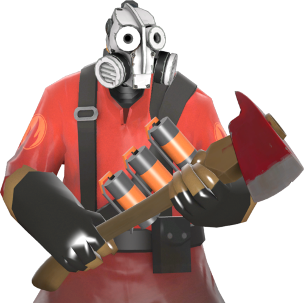

# Rusty Reaper
<br>
Hat tip to [@weideng1](https://github.com/weideng1/) for the image above

# Introduction
In my [day job](https://www.ibm.com/products/datastax) we use (and maintain) a Jenkins instance
with custom AWS runners.  We use this Jenkins instance to test the various Apache Cassandra 
drivers (as well as a few other related programs) we maintain.  The drivers are written in various 
languages so each of our runners attempts to support testing in a way that's native to the language
in question.  On occasion we have to tweak these runners in some way and when that happens it's 
useful to be able to perform the following operations:

* Get a list of the current AWS images for a given language and/or platform
* Delete older AWS images which are no longer used by Jenkins

Rusty Reaper is an attempt to support these operations.  It also represents something larger than
a trivial problem space for me to monkey around with Rust.

# Building
`cargo build --release` should do it.  The generated binary should be called `rr`.

# Usage
Once you have `rr` built you can use it to get a list of all images for a given language and/or
base platform.  For example, to find all the older Java runners based on Ubuntu Bionic you could
do the following:

```
$ ./target/release/rr list --lang java --platform bionic
name                             image_id                creation_date              snapshots                                              
java-driver-bionic-64-00000000   ami-00000000000000000   2024-09-27T10:40:15.000Z   snap-00000000000000000 (volume: vol-00000000000000000)
java-driver-bionic-64-00000001   ami-00000000000000001   2024-09-10T14:46:17.000Z   snap-00000000000000001 (volume: vol-00000000000000001)
java-driver-bionic-64-00000002   ami-00000000000000002   2025-04-01T17:13:13.000Z   snap-00000000000000002 (volume: vol-00000000000000002) 
```

We note that none of these images are in use anymore and that a couple of these are quite old.  Let's
be responsible and clean up after ourselves by deleting the oldest image:

```
$ ./target/release/rr delete -i ami-00000000000000001
Result of image deletion: true 
```

We can now re-run our original query and confirm that somebody is missing:

```
$ ./target/release/rr list --lang java --platform bionic
name                             image_id                creation_date              snapshots                                              
java-driver-bionic-64-00000000   ami-00000000000000000   2024-09-27T10:40:15.000Z   snap-00000000000000000 (volume: vol-00000000000000000)
java-driver-bionic-64-00000002   ami-00000000000000002   2025-04-01T17:13:13.000Z   snap-00000000000000002 (volume: vol-00000000000000002) 
```

We can also cross-check our results via the AWS CLI (or your own preferred method) 